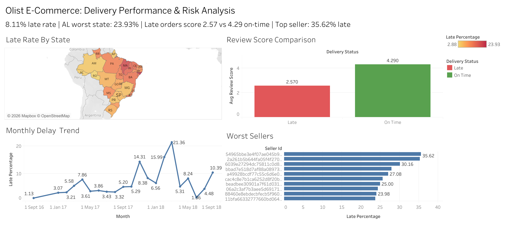

# 🛒 Olist E-Commerce: Delivery Performance & Risk Analysis

End-to-end SQL analysis of Brazil's largest e-commerce dataset (100,000+ orders) to identify delivery failures, geographic risk patterns, revenue at risk, and seller-level accountability gaps.

**[📊 Live Tableau Dashboard →](https://public.tableau.com/app/profile/kumar.saksham2703/viz/OlistDeliveryPerformanceAnalysis_17789432992130/OlistDeliverryAnalysis)**

---

---

## 🧩 Business Problem

Olist operates across all Brazilian states with sellers concentrated in the Southeast. No structured system existed to:
- Identify which sellers consistently deliver late
- Quantify the revenue and satisfaction impact of delays
- Flag geographic regions with disproportionate late rates

---

## 📌 Key Findings

| Metric | Finding |
|--------|---------|
| 📦 Overall late delivery rate | 8.11% (7,826 of 96,470 orders) |
| ⭐ Review score — On Time | 4.29 / 5 |
| ⭐ Review score — Late | 2.57 / 5 **(40% collapse)** |
| 🗺️ Worst state late rate | AL — 23.93% |
| 💸 Top seller revenue at risk | R$26,524 across 128 late orders |
| 📈 Black Friday delay spike | Nov 2017 — 14.31% late rate |

---

## 🔍 Technical Approach

**🗄️ Database**
7-table normalized PostgreSQL schema covering orders, customers, sellers, products, payments, reviews, and geolocation

**⚙️ SQL Techniques Used**
- Window functions for percentage calculations across groups
- CTEs for multi-step layered analysis
- CASE-based risk tier classification (High / Medium / Low)
- Multi-table JOINs across 5+ tables simultaneously
- EXTRACT and EPOCH for delay duration calculations in days
- Master VIEW creation for Tableau dashboard integration

**📋 Analysis Sections**
1. Data quality checks and null handling
2. Overall delivery performance metrics
3. Monthly delay trend analysis
4. Geographic analysis by customer state
5. Business impact — review score vs delivery status
6. Revenue at risk quantification by seller
7. Seller risk scoring and tiering

---

## 📁 Project Structure
**📂 sql/**
- olist_analysis.sql    ← all queries with comments

**📂 results/**
- overall_late_rate.csv
- monthly_delay_trend.csv
- late_order_rate_by_state.csv
- late_orders_by_state.csv
- late_vs_ontime_reviews.csv
- revenue_at_risk_from_late_sellers.csv
- worst_sellers_delay.csv
- README.md

---

## 📊 Dashboard Preview

4 interactive charts built in Tableau Public:
- 🗺️ **Late Rate by State** — choropleth map of Brazil
- 📈 **Monthly Delay Trend** — time series 2016–2018
- 📊 **Review Score Comparison** — Late vs On Time
- 📋 **Worst Sellers** — ranked by late delivery rate

---

## 🗃️ Dataset

| Property | Detail |
|---|---|
| Source | [Brazilian E-Commerce by Olist — Kaggle](https://www.kaggle.com/datasets/olistbr/brazilian-ecommerce) |
| Size | 100,000+ orders |
| Period | 2016 – 2018 |
| Tables | 8 relational tables |

---

## 🛠️ Tools & Technologies

| Tool | Purpose |
|---|---|
| 🐘 PostgreSQL | Data modeling, schema design, SQL analysis |
| 📊 Tableau Public | Interactive dashboard and visualization |
| 🐙 Git & GitHub | Version control and portfolio hosting |

---

## 👤 Author

**Kumar Saksham**  
📧 kumarsaksham560@gmail.com  
🔗 [LinkedIn](https://linkedin.com/in/kumarsaksham) | [GitHub](https://github.com/Saksham3124)
